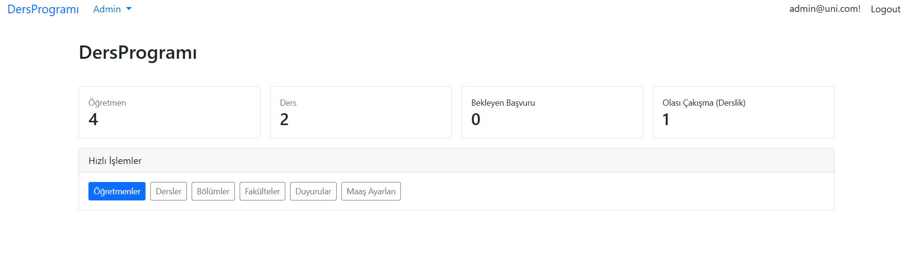
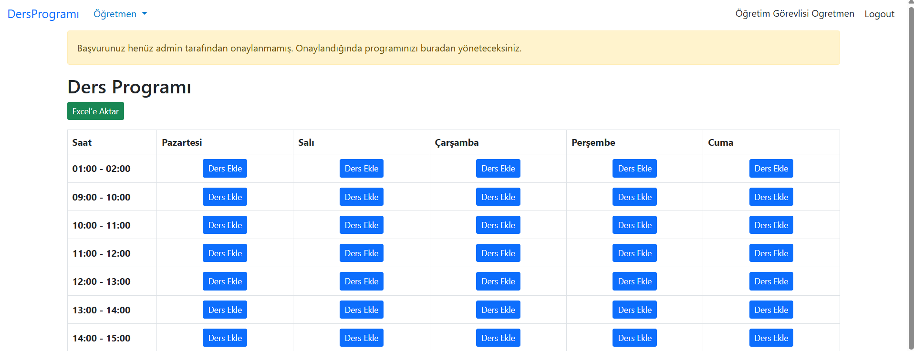
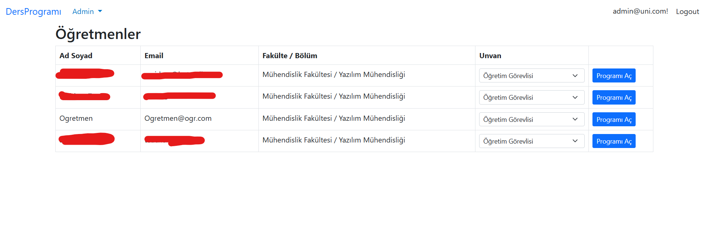
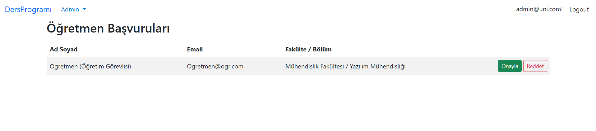
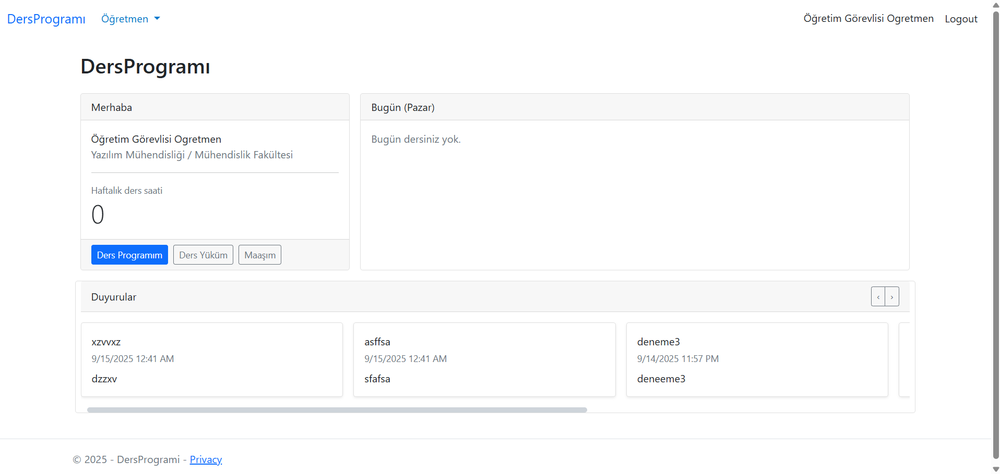

# DersProgramý (ASP.NET Core + EF Core)

Öðretmenlerin haftalýk ders programlarýný yönetebildiði, admin panelinden fakülte/bölüm/ders tanýmlarýnýn yapýldýðý bir web uygulamasý.

## Ekran Görüntüleri







## Ýçindekiler
- [Özellikler](#özellikler)
- [Mimari](#mimari)
- [Kurulum](#kurulum)
- [Veritabaný](#veritabaný)
- [Rol ve Akýþ](#rol-ve-akýþ)
- [Konfigürasyon](#konfigürasyon)
- [Raporlama ve Dýþa Aktarým](#raporlama-ve-dýþa-aktarým)
- [Ekran Görüntüleri](#ekran-görüntüleri)
- [Katkýda Bulunma](#katkýda-bulunma)
- [Lisans](#lisans)

## Özellikler
- Admin:
  - Fakülte/Bölüm/Ders/Saat tanýmlarý
  - Öðretmen listesi ve baþvurularýn onaylanmasý
  - Öðretmene unvan atama ve katsayý yönetimi (maaþ hesabý için)
  - Öðretmenlerin programýný görüntüleme/düzenleme
- Öðretmen:
  - Haftalýk programýný görme ve yönetme (onaylý ise)
  - Unvanýna göre maaþ hesaplamasý ve ders yükü raporu
  - Excel’e tek týkla dýþa aktarma (Program + Yük + Maaþ ayný dosyada 3 sayfa)

## Mimari
- **ASP.NET Core MVC** + **Identity** (Roller: `Admin`, `Teacher`)
- **Entity Framework Core** (SQL Server)
- UI: Bootstrap 5
- Paketler:
  - ClosedXML (Excel): MIT
  - EF Core / Identity: MIT
  - Bootstrap / jQuery: MIT

## Kurulum
1. `appsettings.json` içinde `DefaultConnection`’ý kendi SQL Server’ýna göre güncelle.
2. Veritabanýný oluþtur:
   ```bash
   dotnet tool install --global dotnet-ef
   dotnet ef database update
