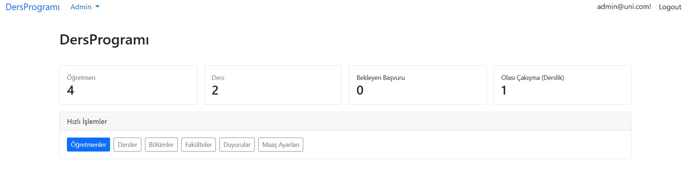
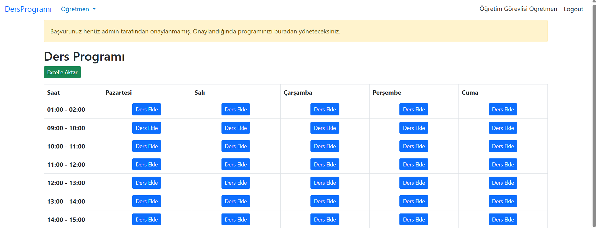
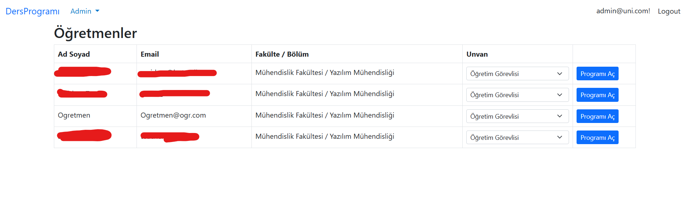
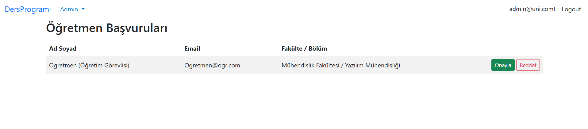
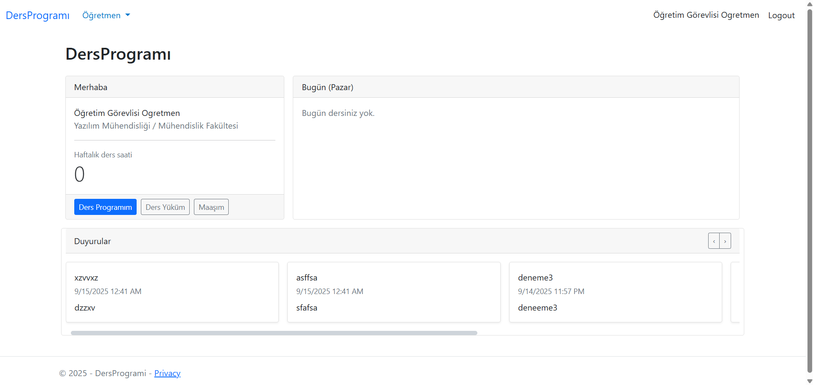

# DersProgramı (ASP.NET Core + EF Core)

Öğretmenlerin haftalık ders programlarını yönetebildiği, admin panelinden fakülte/bölüm/ders tanımlarının yapıldığı bir web uygulaması.

## Ekran Görüntüleri







## İçindekiler
- [Özellikler](#özellikler)
- [Mimari](#mimari)
- [Kurulum](#kurulum)
- [Veritabanı](#veritabanı)
- [Rol ve Akış](#rol-ve-akış)
- [Konfigürasyon](#konfigürasyon)
- [Raporlama ve Dışa Aktarım](#raporlama-ve-dışa-aktarım)
- [Ekran Görüntüleri](#ekran-görüntüleri)
- [Katkıda Bulunma](#katkıda-bulunma)
- [Lisans](#lisans)

## Özellikler
- Admin:
  - Fakülte/Bölüm/Ders/Saat tanımları
  - Öğretmen listesi ve başvuruların onaylanması
  - Öğretmene unvan atama ve katsayı yönetimi (maaş hesabı için)
  - Öğretmenlerin programını görüntüleme/düzenleme
- Öğretmen:
  - Haftalık programını görme ve yönetme (onaylı ise)
  - Unvanına göre maaş hesaplaması ve ders yükü raporu
  - Excel’e tek tıkla dışa aktarma (Program + Yük + Maaş aynı dosyada 3 sayfa)

## Mimari
- **ASP.NET Core MVC** + **Identity** (Roller: `Admin`, `Teacher`)
- **Entity Framework Core** (SQL Server)
- UI: Bootstrap 5
- Paketler:
  - ClosedXML (Excel): MIT
  - EF Core / Identity: MIT
  - Bootstrap / jQuery: MIT

## Kurulum
1. `appsettings.json` içinde `DefaultConnection`’ı kendi SQL Server’ına göre güncelle.
2. Veritabanını oluştur:
   ```bash
   dotnet tool install --global dotnet-ef
   dotnet ef database update
